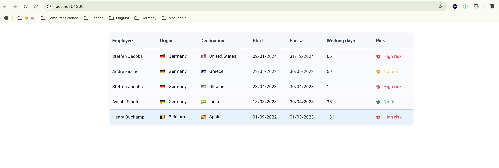

# Workation Challenge Submission

A full-stack demo application for managing and displaying "workations" (remote work trips), built for the WorkFlex coding challenge.

---

## Features

- **Backend:**
  - Spring Boot (Java)
  - Imports workations from `workations.csv` on startup
  - H2 in-memory database for easy setup
  - Global Exception Handling
  - REST API with sortable endpoints for workation data

- **Frontend:**
  - Angular + Angular Material (standalone components)
  - Sortable, responsive table with real-time sorting
  - Country flags (emoji) for origin and destination
  - Risk indicator icons (SVGs with color mapping)
  - Hover and striped row styling
  - Professional, modern UI matching company branding

---

## Technologies Used

- **Backend:** Java 17, Spring Boot, Spring Data JPA (Hibernate), Lombok, H2
- **Frontend:** Angular 19, Angular Material, TypeScript
- **Dev Tools:** IntelliJ IDEA, WebStorm, Postman, Git

---

## How to Run
### Backend

1. **Navigate to backend folder:**

cd backend
2. **Build and start the backend:**
   ./mvnw spring-boot:run
    - The backend will import `workations.csv` from `src/main/resources/data/`.
    - The REST API will be available at `http://localhost:8080/workflex/workation`.

3. **(Optional) Access H2 Console:**
  - Go to [http://localhost:8080/h2-console](http://localhost:8080/h2-console)
  - JDBC URL: `jdbc:h2:mem:testdb`
  - User: `sa` (no password)

---

### Frontend

1. **Navigate to frontend folder:**

cd frontend
**Install dependencies:**

npm install

3. **Run the app:**
  - The frontend is available at [http://localhost:4200](http://localhost:4200)
  - Make sure the backend is running for data to load.

---

## Testing

- **Backend:**
  - Run unit tests:
    ./mvnw test

- **Frontend:**
  - Run unit tests:
    ng test

---

## Project Structure
mainFolder/
  backend/
      src/
        main/
          java/
      resources/
      data/
        workations.csv
  frontend/
      src/
        app/
          workation-table/

---

## CSV Import Details

- The backend automatically imports all workations from `workations.csv` at startup.
- If the file is missing or malformed, a clear error will be shown in logs.

---

## Screenshots

---

## Notes

- Both risk levels "LOW" and "NO" are displayed as "No risk" in the frontend, with different colors (yellow and green respectively), following the challenge requirements.
- The project uses standalone Angular components for modern best practices.
- All code is organized for clarity, maintainability, and scalability.

---

## Author

Submitted by Navin Tamilchelvam for the WorkFlex coding challenge.

    
